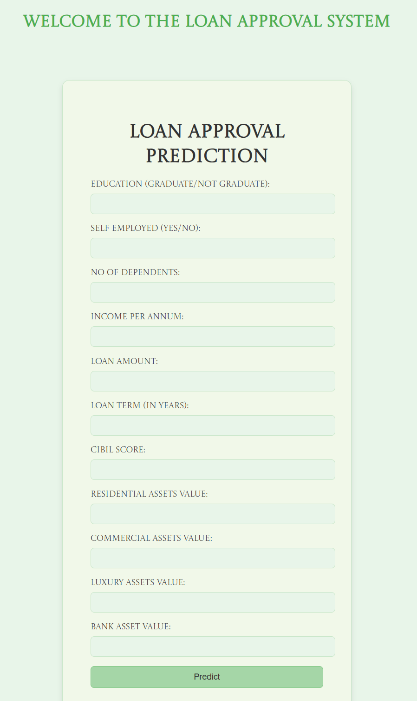

# Loan Approval Prediction System

<p align="center">
  
</p>

## Project Overview
This project is a Machine Learning–based Loan Approval Prediction System that predicts whether a loan application will be Approved or Rejected based on applicant details.  

The motivation behind this project is to automate the loan approval process, which traditionally requires manual checks of applicant background and creditworthiness. By leveraging data-driven models, financial institutions can reduce human error, speed up decision-making, and maintain consistency in approvals.  

The system analyzes multiple applicant features such as income, dependents, requested loan amount, loan term, credit score, and assets to determine the likelihood of approval. Different machine learning algorithms were tested to identify the most reliable predictor of loan approval status.

---

## Dataset
- **Source**: `loan_approval_dataset.csv`  
- **Target Variable**: `loan_status` (Approved / Rejected)  

### Features
- **Numerical**:  
  - `no_of_dependents` – Number of dependents supported by the applicant.  
  - `income_annum` – Annual income of the applicant.  
  - `loan_amount` – Loan amount requested.  
  - `loan_term` – Loan repayment term in months.  
  - `cibil_score` – Credit score of the applicant.  
  - `residential_assets_value` – Value of residential assets owned.  
  - `commercial_assets_value` – Value of commercial assets owned.  
  - `luxury_assets_value` – Value of luxury assets owned.  
  - `bank_asset_value` – Value of bank assets held by the applicant.  

- **Categorical**:  
  - `education` – Applicant’s education status (Graduate / Not Graduate).  
  - `self_employed` – Whether the applicant is self-employed (Yes / No).  

---

## Data Preprocessing
1. **Dropped Irrelevant Column**: Removed `loan_id`.  
2. **Handling Missing Values**:  
   - Numerical features imputed with mean.  
   - Categorical features imputed with mode.  
3. **Encoding Categorical Variables**: Converted `education` and `self_employed` into numeric form using Label Encoding.  
4. **Feature Scaling**: Standardized numerical columns using StandardScaler.  
5. **Train-Test Split**: 80% training, 20% testing.

---

## Models Implemented
- Logistic Regression  
- Decision Tree Classifier  
- Random Forest Classifier  
- XGBoost Classifier  

Random Forest and XGBoost delivered the most consistent and accurate results.

---

## Model Evaluation
- Metrics used: Accuracy Score, Confusion Matrix (heatmap), Classification Report (Precision, Recall, F1-score)  
- Cross-validation was applied for better generalization.  
- Hyperparameter tuning using GridSearchCV optimized Random Forest parameters.

---

## Results
- Logistic Regression: Baseline performance  
- Decision Tree: Improved interpretability, moderate accuracy  
- Random Forest: High accuracy and robustness  
- XGBoost: Best overall performance with consistent predictive power  

---

## Project Workflow
1. Load dataset  
2. Preprocess data (handle missing values, encode categorical features, scale numerical features)  
3. Train-test split  
4. Train multiple ML algorithms  
5. Evaluate models using metrics and confusion matrices  
6. Cross-validation for reliability  
7. Hyperparameter tuning (Random Forest)  
8. Select best-performing model (XGBoost / Random Forest)  
9. Predict outcomes for new applicants  

---

## Prediction for New Applicants
Example:

```python
applicant_data = {
    'no_of_dependents': 2,
    'income_annum': 500000,
    'loan_amount': 200000,
    'loan_term': 12,
    'cibil_score': 750,
    'residential_assets_value': 100000,
    'commercial_assets_value': 50000,
    'luxury_assets_value': 25000,
    'bank_asset_value': 150000,
    'education': 'Graduate',
    'self_employed': 'No'
}

predict_loan_approval(applicant_data)
# Output: Approved / Rejected
